<h1 align="center">🏁 WikiRace</h1>

<p align="center">
  <b>Race your friends through Wikipedia.</b><br>
  Everybody gets the same start page and the same target. First one there, clicking links only, wins.
</p>

<p align="center">
  
  
  
</p>

<p align="center">
  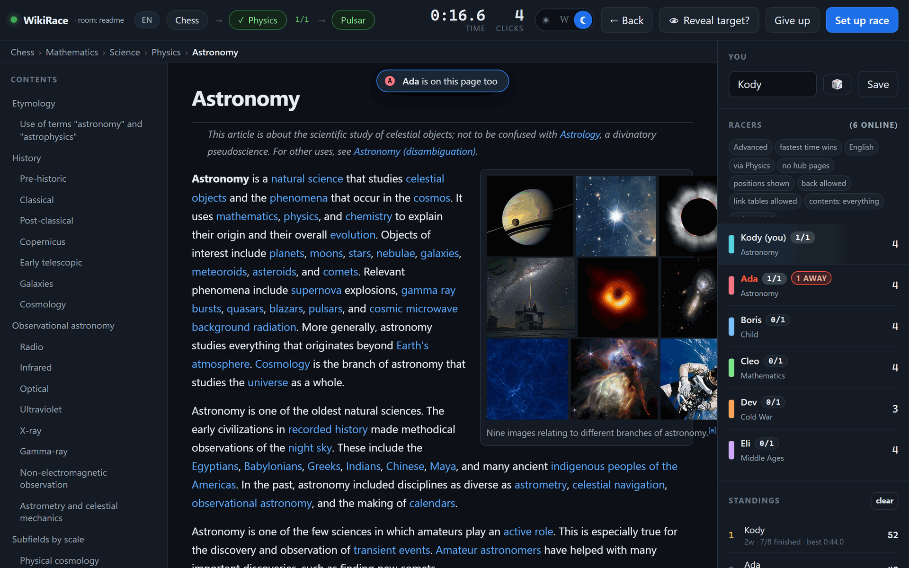
</p>

On a local network it needs **no server at all**: each player runs the same
script, the copies find each other, and they gossip directly. Nobody hosts, and
nobody closing their laptop ends the game. Or run one copy in host mode and
everybody else just opens a link in a browser, which is also how you leave it
running on a NAS or a home server.

**Jump to:** [Quick start](#quick-start) ·
[A race, start to finish](#a-race-start-to-finish) ·
[Scoring](#scoring) ·
[Running it on a NAS](#running-it-on-a-nas-or-home-server) ·
[If players can't see each other](#if-players-cant-see-each-other)

## Quick start

There are two ways to play: everyone installs it, or one machine hosts and
everyone else just opens a link. They work **at the same time**, so half your
friends can install it and the other half can open a link, and everyone is in the
same game, seeing each other as equals. The third column is the second one left
running somewhere permanent.

| | Everyone installs | One machine hosts | Always on |
|---|---|---|---|
| **Who installs anything** | everybody | only the host | only the server |
| **Everyone else** | installs it too | opens a link in any browser | opens a link in any browser |
| **Start it with** | `Play WikiRace.bat` or `./play.sh` | `./play.sh --host` | `docker compose up -d` |
| **Good for** | a LAN party where everyone has a laptop | when only one of you wants to install it | a standing game for the group |

### 1. Everyone installs (no server at all)

Copy this folder to each machine, then:

- **Windows:** double-click `Play WikiRace.bat`. It installs Python the first
  time if the machine doesn't have it.
- **Linux / macOS:** run `./play.sh` in a terminal. (If it says permission
  denied, run `chmod +x play.sh setup.sh` first.)

The copies find each other over the local network. Nobody hosts, nobody is
special, and one person quitting doesn't end the game.

### 2. One machine hosts, everyone else opens a link

```sh
./play.sh --host
```

On Windows:

```
"Play WikiRace.bat" --host
```

It prints a link like `http://192.168.1.42:8420/`. Everyone else opens that in
a browser (phone, laptop, anything) and each browser becomes its own player.
**They install nothing.** The lobby shows the link with a **Copy** button, so
you can paste it into a group chat.

The first time a browser opens the game it asks what to call you, and then
you're in the lobby. When everyone shows up, hit **Set up race**, and everyone
gets a 3-2-1 countdown together.

### 3. Leave it running on a NAS

Host mode is all it takes. See [Running it on a NAS or home
server](#running-it-on-a-nas-or-home-server).

## A race, start to finish

### 1. Everybody joins

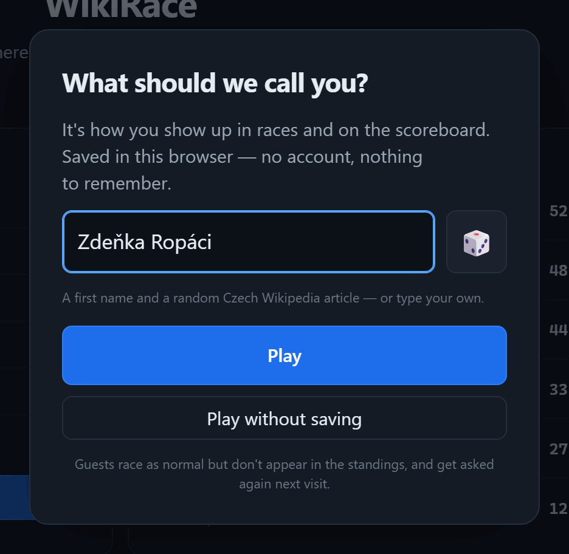

The first time a browser opens the game, it asks for a name, with one already
filled in, so a single tap on **Play** is enough. 🎲 rolls another, or type your
own.

The lobby then shows who's here and who's ready, the standings, the races played
before, and the invite link.

<br clear="all">

<p align="center">
  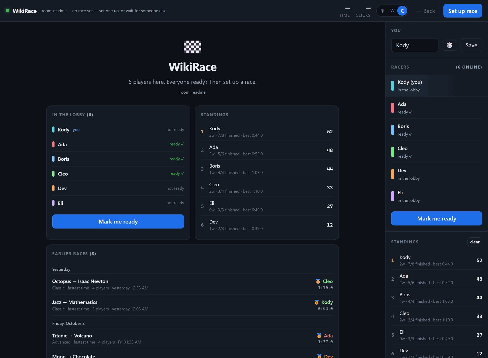
</p>

### 2. Someone sets up the race

Whoever presses **Set up race** picks one of three games:

<table>
<tr>
<td width="48%" valign="top">
  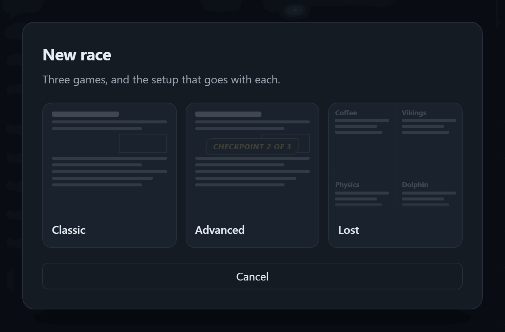
  <br><br>
  <b>Classic</b> is one start, one target, fastest time. Pick two articles and
  go.<br>
  <b>Advanced</b> is every rule the game has: checkpoints, banned hubs, no Back
  button, fewest clicks.<br>
  <b>Lost</b> has no start to pick. Everyone wakes up somewhere different and
  races to the same target.
</td>
<td valign="top">
  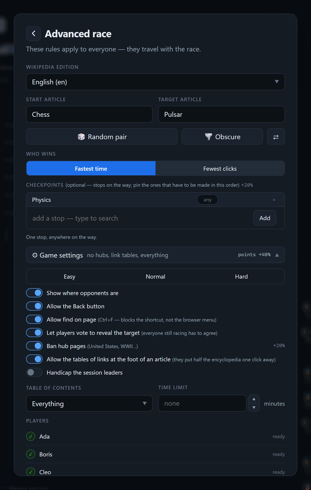
</td>
</tr>
</table>

The rules **travel with the race**, so everyone plays the same game. The ones
people argue about (the Back button, find on page, hub pages, contents, the time
limit) sit together in **Game settings**, with **Easy**, **Normal** and **Hard**
presets, and the setup screen tells you what a race will pay as you change them.
[Race setup in full](#race-setup-in-full) has every setting.

**Ready check.** Everyone hits *Mark me ready* in the sidebar, and the setup
screen shows who's in. **Start race** unlocks once everyone's ready, and there's
a *Start anyway* underneath for when someone wanders off.

### 3. Go

Everyone gets the same countdown, and then it's you and Wikipedia. Only links
inside the article count. What's on the screen:

- **The top bar** shows the route (start, any stops, and the target), the clock
  and your clicks. Stops tick off as you reach them.
- **The trail** under it is the pages you've been through.
- **The side panel** shows everyone's page and click count a few times a
  second. A **1 AWAY** badge goes up when someone is one link from the target.
  Land on a page someone else is reading and a pill drops in over the article:
  *Ada is on this page too*.
- **The rules strip** under *Racers* lists the rules this race is played under.
- **The play-by-play** below it is a live commentary, newest first.
- **Contents** sit beside the article if the race allows them.

Drag the side panel's edge to make it wider or narrower, press the arrow keys on
it to nudge it, or double-click to put it back. It's remembered on your own
machine.

### 4. Crossing the line

Finishing throws up a full-screen splash with your place, time and clicks. The
place is **arrival order**, first to arrive, second to arrive, because that's the
one thing that can't change once you're over the line: in a fastest-time race
someone still going can yet post a better time, since the clock doesn't count
loading. The results screen underneath has the final standings. Tap the splash
to get to them sooner.

<p align="center">
  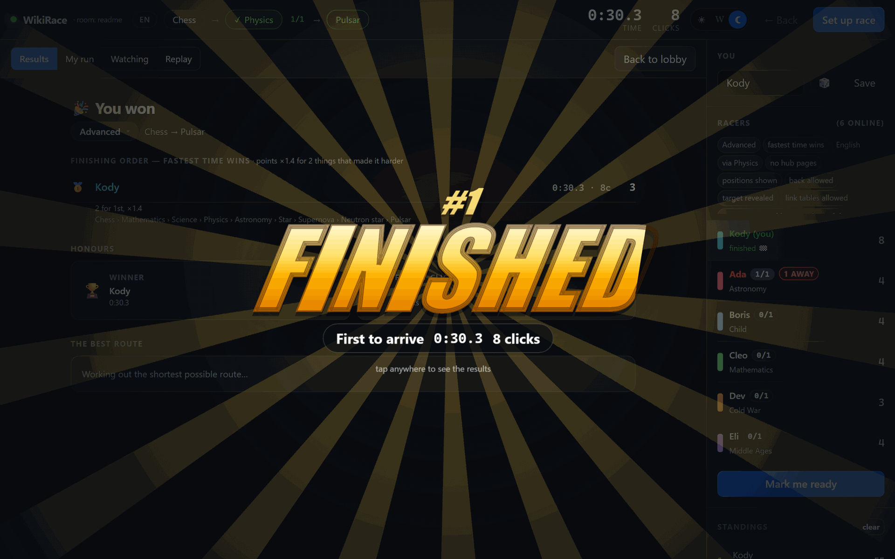
</p>

### 5. Afterwards

Finishing opens a hub with four tabs.

**Results** has the finishing order with everyone's full route and what each
player was paid and why, plus honours: winner, fewest clicks, scenic route,
trailblazer (pages nobody else found), photo finish, crossed paths. Underneath,
the shortest route that actually existed: *"the shortest route was 2 clicks, e.g.
via Colombia. Best anyone managed was 4."* That's checked exhaustively against
every page the start links to, so "no route in 2 clicks" is a real answer rather
than a search that gave up.

<p align="center">
  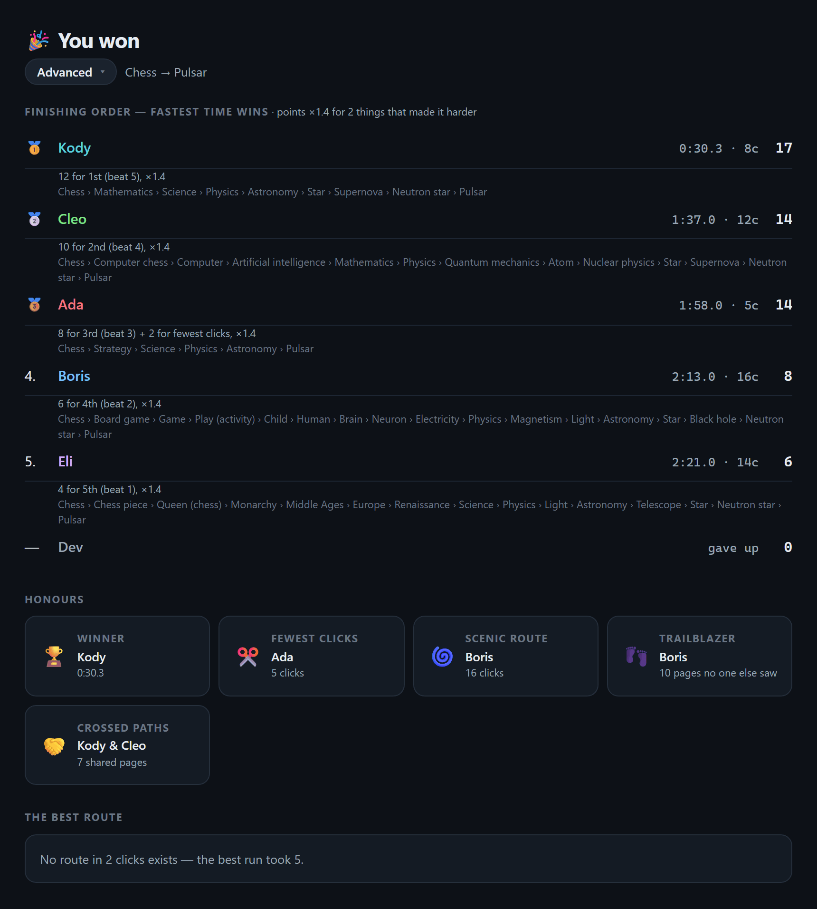
</p>

**My run** is your trail with the time you reached each page. Click any step to
re-read that article. Good for finding the exact moment you went wrong.

**Watching** shows everyone still going: their actual page, scrolled to where
they are on it. **Tiled** shows all at once, **Single** gives one player the full
window. Panels follow live as people click through and scroll. Links are dead so
you can't wander off. Article text never crosses the network: peers broadcast
only *which* page and *how far down*, and your copy fetches it from Wikipedia.

<p align="center">
  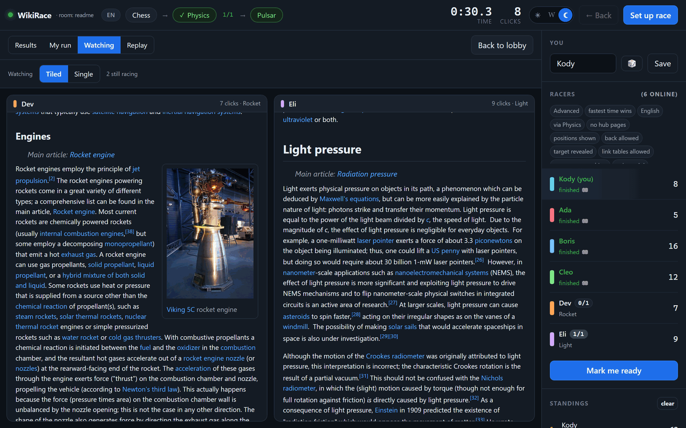
</p>

**Replay** is the race played back, on whichever view you pick. The first time
the Replay tab is on screen it plays by itself: the drawing dims and a light runs
each player's route, leaving a lit trail, on the race clock. A light waits on a
page for as long as that player read it, then hops, so everyone finishes in the
order they really did. The whole race takes 18 seconds. The button in the corner
plays it again or stops it, and the game time counts up beside it; stopped, every
view shows the whole race.

<p align="center">
  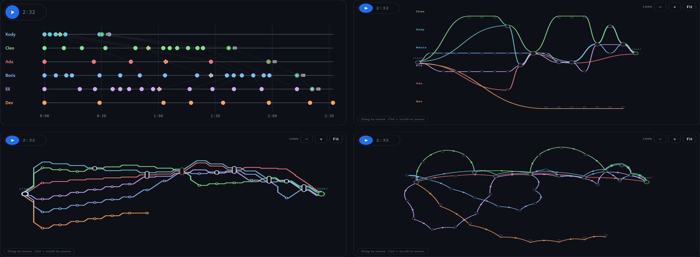
</p>

Under every view is a box per player: the page they're on at that moment, their
clicks so far, and their place once they finish. Tap a box to follow just that
player, and the others fade. Tap it again for everyone. Switching views
mid-replay carries on from the same moment.

| View | What it's good at |
|---|---|
| **Timeline** | The race as it happened: one lane per player in race time. Dotted links join pages more than one player visited, so you can spot two people on the same page at the same time without knowing it. Race the same pair twice and your previous run appears as a dashed ghost lane. |
| **Aligned** | Routes lined up like a diff. Everyone keeps a lane and moves left to right; where lines merge into one dot, those players were on that page at the same point in their race. A page reached in a different order gets a faint arc between its two dots. |
| **Metro** | A transit map. Players who clicked the same link run side by side, and a page more than one player visited is an interchange. |
| **Spring** | Pages float to wherever their links pull them, so shared pages draw routes together. No axis; arrows show direction. |
| **Collapsed** | Stretches only one player saw shrink to a single `+N` line; tap it for the pages. What's left is where routes met and split. |

The four maps are maps: drag to move, pinch or Ctrl + scroll to zoom (click the
map first and the plain wheel zooms too), and page names appear once you're
close enough to read them. Tap a dot to see which page it is and who was there.
**Combined** puts everyone on one map; **Separate** gives each player a panel,
and the panels move together, so the same page is always in the same spot. The
view is remembered on your device.

> [!NOTE]
> If the race hid opponent positions, watching stays shut until everyone has
> finished. Otherwise finishing early would be a way to scout for whoever's still
> racing next to you.

## Race setup in full

Every game has the same **Game settings**; what changes with the game is what
else the setup screen asks for.

| | Classic | Advanced | Lost |
|---|:-:|:-:|:-:|
| Wikipedia edition | ✓ | ✓ | ✓ |
| Start article | ✓ | ✓ | |
| Target article | ✓ | ✓ | ✓ |
| Who wins | fastest time | ✓ | ✓ |
| Checkpoints | | ✓ | ✓ |
| Game settings | ✓ | ✓ | ✓ |

| Setting | |
|---|---|
| **Wikipedia edition** | 28 languages. Everyone races on the chosen one. |
| **Start / target article** | Type to search with live suggestions, or roll a pair. **🎲 Random pair** picks well-known, densely-linked articles, so the race is winnable. **🌪️ Obscure** is genuinely random, and often brutal. ⇄ swaps the two. |
| **Lost** | Nobody picks a start: everyone is dropped on a different random page (one of a dozen well-linked ones the game rolls) and the race is whoever reaches the target first. Your page is decided once, so a reload lands you back on it, and nobody else gets it. Pick only a target. |
| **Who wins** | Fastest time, or fewest clicks. Whichever you don't pick still earns a bonus, so both styles of play are worth something. |
| **Checkpoints** | Up to six articles you must pass through. The list is the order: pin a stop with 📌 and it has to be made at that place. Pin none for any order, pin one for "this one last", pin them all for a fixed route. 🎲 rerolls both the order and how much of it is fixed. Stops move with ▲▼. They show in the top bar and tick off as you reach them, and each one throws up a big *Checkpoint 2 of 3* splash. The target won't accept you until they're all done. Enforced by the game itself, not just your browser. |

**Game settings** is folded away until you open it. The presets are a quick way
in, and the switches underneath are the same settings, so whichever you touch,
the other follows.

| | Easy | Normal | Hard |
|---|:-:|:-:|:-:|
| Show where opponents are | ✓ | ✓ | |
| Allow the Back button | ✓ | | |
| Allow find on page | ✓ | | |
| Let players vote to reveal the target | ✓ | ✓ | |
| Ban hub pages | | | ✓ |
| Allow the tables of links at the foot of an article | ✓ | | |
| Table of contents | everything | main sections | off |
| Time limit | none | none | 10 minutes |

| Setting | |
|---|---|
| **Show where opponents are** | Live positions on or off for everybody. |
| **Allow the Back button** | Off makes it a one-way trip. |
| **Allow find on page** | Off intercepts Ctrl+F, Cmd+F, F3 and Ctrl+G during a race. Honest limitation: a page can block the *shortcut*, not the browser's own Find menu. This discourages the reflex rather than making it impossible. |
| **Let players vote to reveal the target** | Lets players put the destination on screen to read, if they all agree. See [Nobody knows the target](#nobody-knows-the-target). On by default: the vote itself is the safeguard. |
| **Ban hub pages** | Blocks *United States*, *World War II* and two dozen other giants. Nearly every lazy route runs through one of them, so this is the setting that stops repeat games feeling identical. |
| **Allow the tables of links at the foot of an article** | The boxes of related links that sit under most articles. The one on *Finger* lists every other finger, the hand, the arm. Off by default, and then they aren't on the page at all: they put half the encyclopedia one click from the other half. *One click away* counts them only when they're allowed. |
| **Handicap the session leaders** | Whoever's 1st and 2nd in the standings start 10s and 5s late. Their clock runs during the wait. |
| **Table of contents** | A contents list beside the article: *Off*, *Main sections only*, *Sections and subsections*, or *Everything*. Genuinely useful for skimming a long page for the link you want, which is exactly why it's off by default and set for the whole race. |
| **Time limit** | Any number of minutes up to 180, or none. Anyone still going when it runs out is a DNF. |

Each setting that makes the race harder carries a faint **+20%** at the end of
its row, and the Game settings header carries the total (*points +40%*), where
it stays in sight even with the settings folded away. See
[Scoring](#scoring) for what that means.

Settings persist between races, so setting up the same race again is quick.

## The rules

- Only links inside the article body count. File, Category, Template, Talk and
  other non-article links are struck through and dead. The list of what counts
  is read from whichever Wikipedia you're playing on, so `Soubor:` and `Datei:`
  are blocked on the Czech and German editions just like `File:` is on English.
- **Back** is free: it doesn't add a click, it just rewinds your trail. The host
  can switch it off.
- Redirects resolve, so *USA* counts as arriving at *United States*.
- **The clock is fair.** The timer stops while an article is loading. What it
  measures is your thinking, not your bandwidth, so a slow connection doesn't
  lose you the race. (Borrowed from [wikispeedrun.org](https://wikispeedrun.org),
  which does the same.)

## Scoring

| | |
|---|---|
| Finishing | 2 points |
| Every player you beat | +2 points each |
| Fewest clicks in the race | +2 bonus (shared on ties) |
| Gave up, or ran out of time | 0 |

You beat everyone who finished behind you and everyone who gave up or ran out
of time, guests included (a guest takes their place but isn't paid). So winning
against one other player pays 4, against four pays 10, and against seven pays
16; a race on your own pays 2. A player still on the course hasn't been beaten
yet, so a finisher's points settle as the others come in. The fewest-clicks bonus
needs somebody to beat, and in a fewest-clicks race it goes to whoever was
quickest instead. It is worth exactly one place, so it can lift a player level
with the one above them and never past.

**Harder races pay more.** Every rule that makes a race harder adds **20%** to
everything that race pays:

- no going back
- no find on page
- link tables hidden
- contents off
- hubs banned
- the target can't be revealed
- positions hidden
- a time limit of ten minutes or less
- a lost start
- each checkpoint
- a pinned checkpoint order (once, and only with two or more stops)

So an Easy Classic race pays ×1, Normal Classic ×1.6 and Hard Classic ×2.6; the
most there can be is ×4.2. Race setup shows the marks as you change the rules,
and Results says what each player was paid and why. The handicap doesn't count:
it holds the leaders back rather than making the race harder for everyone.

Standings count the most recent 60 races and are rebuilt from the shared race
history, so every player's scoreboard agrees without anyone owning it. Older
races aren't lost: every race ever played stays in `wikirace.db`, and its replay
still opens.

## Names and the scoreboard

**Picking a name.** The suggestion is a first name from Czech Wikipedia's lists
of given names plus a random Czech Wikipedia article: *Robin Boson*, *Miloslav
Nemes*, *Kody Skleník*. **Play without saving** races as a guest: you're in the
race results, but not in the standings, and the game asks again on your next
visit (a refresh keeps the name). A guest can keep their name later from the
sidebar, where there's also a 🎲 for renaming.

**Your name is you.** Kody on the laptop and Kody on the phone are the same
player, with one score: no login, just the name, in any mix of capitals and
spacing. It follows that renaming is becoming somebody else: the old name keeps
its points, and the new one starts fresh. Two different people choosing the
same name would become one player, which is why the name picker says so if you
type a name that's already on the scoreboard or in the game right now, and why
the names it suggests are ones nobody has used.

**A name races once per race.** If two people in the game share a name, the
sidebar says so before the race. Whoever joins the race first gets the name;
anyone else under it is stopped at the start line and asked to pick another,
then joins the same race. That goes for a second device of your own too, and
for guests. While a race is on, nobody can rename themselves into a name that's
in it; once everyone's done, the name is free again.

Your name is saved in your own browser, not on the host, so restarting the game
doesn't cost anyone their name: each browser simply reclaims it on reconnect.

One wrinkle worth knowing: browsers file that memory under the address you
visit. As long as the game keeps the same address, which it does on a server
that stays put, your name survives restarts. If the address changes, browsers
treat it as a different site and you'll be asked again.

## Nobody knows the target

Some pairs are unraceable because nobody has the faintest idea what the
destination even *is*. Rather than abandon the race, the table can vote to put
the target page on screen and read it.

Press **👁 Reveal target?** in the top bar. That's your yes, and it raises the
question for everyone else: the button turns amber and shows the count, so
nobody misses it. **Every player still racing has to agree.** One refusal and
it stays shut; anyone can change their mind either way while it's undecided.

<p align="center">
  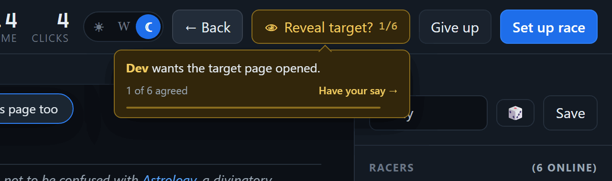
</p>

Once it's unanimous the page opens and **stays open for the rest of the race**.
The button becomes **📖 Target**: read it, close it, come back to it as often
as you like. It remembers where you'd scrolled to. Esc closes it.

<p align="center">
  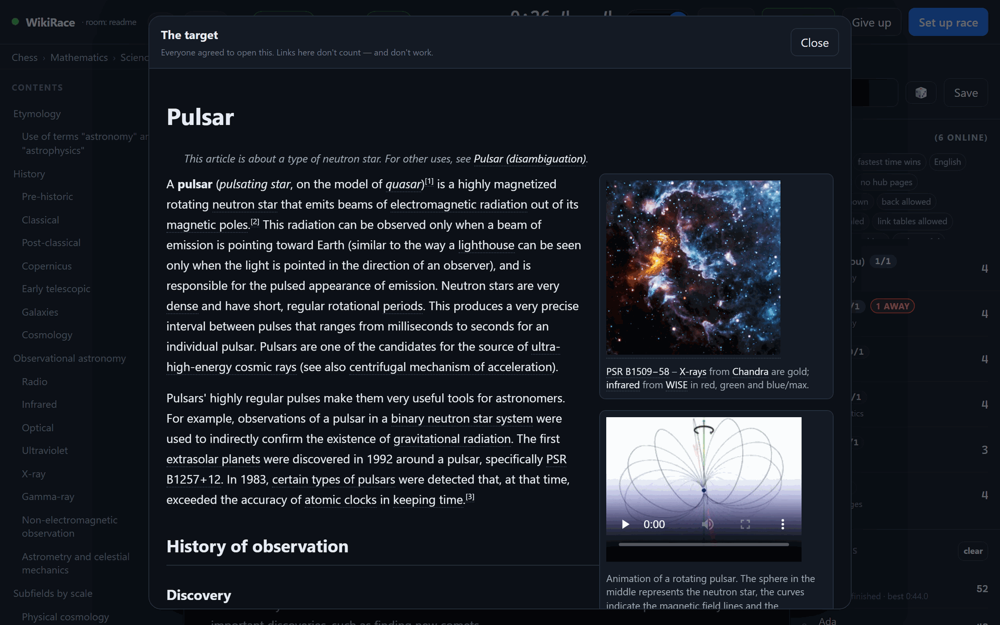
</p>

Some deliberate limits:

- **Links in that window don't work.** It's there to be read, not to be used as
  a way round the race. You still have to get to the target yourself.
- **Your clock keeps running** while you read. Studying the destination is part
  of your time, the same as thinking is.
- **Only people still racing get a vote.** Anyone who has finished or given up
  is out of the count, so a player who has walked away can't hold up the rest.
- **The grant can't be taken back.** Once it's open it's open, even if someone
  later changes their vote or drops off the network.
- Whoever sets up the race can switch the whole thing off, and races that were
  revealed are marked *target revealed* in the rules strip.

Reading the destination is a real help: you learn what links *into* it, so you
can work backwards. It is not a shortcut, and it costs everyone the same.

## Seeing each other

While a race runs, the sidebar shows everyone's current article and click count,
updating a few times a second.

**Show where opponents are** is set for the whole race in the setup screen, so
it's the same for everyone. With it off you still see click counts: you know
whether you're winning, just not where anyone is. There's also a personal
toggle in the sidebar, which can only hide more, never reveal what the race
rules hid. The *on this page too* pill follows the same rule, and stays quiet
on the start page, where everyone begins together.

Finished runs reveal the full path everyone took.

**Play-by-play.** The sidebar runs a live commentary while the race is on, every
move anyone makes, newest first. When somebody lands on a page that links
straight to the target, it shouts about it:

```
Ada is one click away!
Ada → Colombia
Boris → Brazil
```

One click away means a link you could actually click. The links API behind it
sees every link in the article, including the ones in the tables of related
links and the rest of the furniture the game hides, so the shout is checked
against the page as the race actually draws it. Suppressed, like everything else,
when the race hides positions.

## Every race you've played

Every race with a result in it is kept, and the lobby points at them. **Earlier
races** shows the newest eight, with each one's game, winner and time. **Show
older races** opens the **Every race** screen: everything ever played, grouped by
evening, with filters for the game, a player, and a page that was a start, a
target or a stop.

<p align="center">
  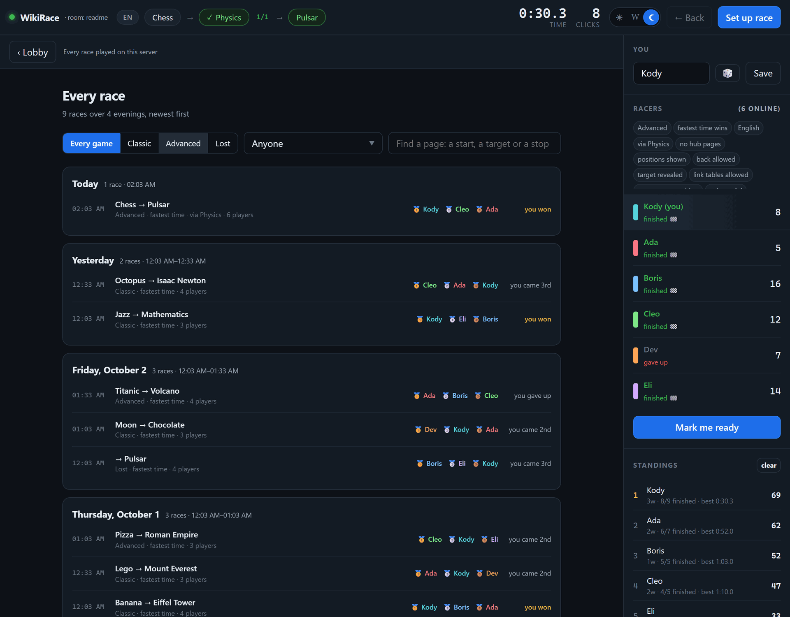
</p>

A race opens on a page of its own, with its results, its replay and its steps,
and a **Copy link** button that gives you an address for it. **Play this again**
opens race setup filled in with that race's rules (a Lost race keeps only its
target), free to change, and then it's Start. A race is named by its game and its
route wherever it's shown, such as `Classic · Chess → Pulsar`, and the game's name
is a chip you can press to see the rules it was played under.

## How it looks

Top right of the bar is a round knob in a three-slot track. Slide it to pick:

<p align="center">
  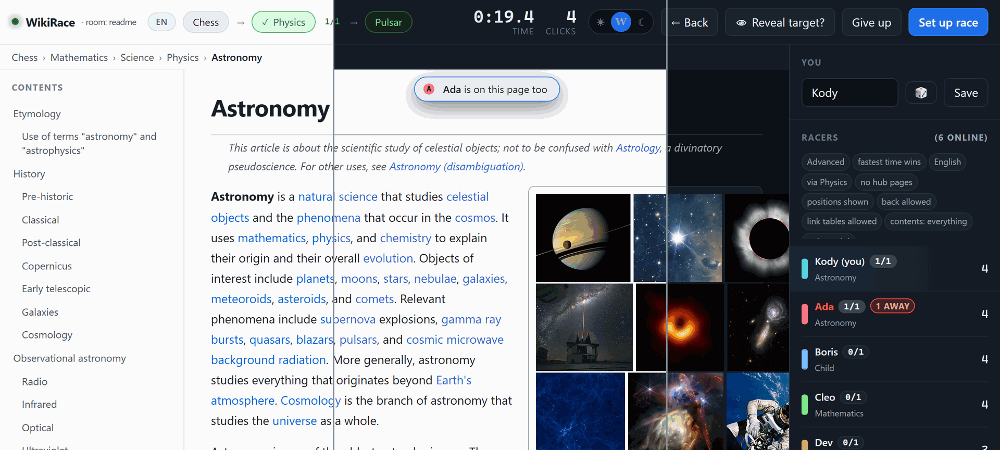
</p>

| | |
|---|---|
| ☀ | light throughout |
| W | dark game, article done out like Wikipedia |
| ☾ | dark throughout (the default) |

The middle one is worth a try if the dark article is hard on your eyes but you
don't want the rest of the screen going white mid-race.

It's a per-browser choice, remembered on your own machine next to your name.
Nobody else sees your setting, and it isn't part of the race rules.

## Running it on a NAS or home server

Host mode is all it takes to leave the game running somewhere permanent, so
it's there whenever people fancy a race rather than only while somebody's
laptop is open.

### TrueNAS SCALE

The image is built by GitHub Actions on every push and published to this
repo's registry, so the NAS only has to pull it. Nothing is built there and
you don't need the source on the box at all.

1. Make a dataset for the scoreboard, e.g. `/mnt/tank/apps/wikirace`, and note
   the UID/GID that owns it.
2. Take `docker-compose.yml` from this repo. Set `WIKIRACE_CODE` to something
   only your friends know, point the volume at that dataset, and set `user:`
   to match its owner.
3. **Apps → Discover Apps → Custom App → Install via YAML**, and paste it in.

It pulls `ghcr.io/machmar/wikirace:latest`, built for both x86 and arm.

Then everyone opens `http://your-nas:8420/?code=YOURCODE`. The code is
remembered per browser, so it's asked for once.

It also runs anywhere else Docker does:

```sh
docker compose up -d
```

To take a new version later, `docker compose pull && docker compose up -d`, or
hit **Update** on the TrueNAS app.

Or without Docker at all, since it's one script and one HTML file:

```sh
python3 wikirace.py --host --no-browser --no-discovery \
        --code YOURCODE --data-dir /mnt/tank/apps/wikirace
```

<details>
<summary><b>Portainer, and a package that won't pull</b></summary>

**Portainer** takes the same file as a stack, with one caveat: don't add a
`build:` line. Portainer runs builds with nowhere to put a Docker config, so
it fails with `mkdir /.docker: permission denied`. The compose file here has
no `build:` for exactly that reason. If you do want to build rather than pull,
do it on a machine with a shell (`docker build -t wikirace .`) and point the
stack at the tag you get.

The package is public, so the NAS pulls it without logging in to anything,
checked by fetching the manifest anonymously, which is exactly what `docker
pull` does. If you fork this and your copy comes out private, the pull fails
with `denied`; make it public under repo → **Packages** → *wikirace* →
**Package settings** → **Change visibility**, or run `docker login ghcr.io` on
the NAS with a token that can read packages.

</details>

<details>
<summary><b>Settings (environment variables)</b></summary>

Everything can come from the environment, which is how a NAS app is
configured, so no command line is needed:

| | |
|---|---|
| `WIKIRACE_CODE` | required to join. **Set this.** |
| `WIKIRACE_DATA` | where the standings are kept. Mount a volume here. |
| `WIKIRACE_ROOM` | only matters if other copies run on the same network. See [Rooms](#rooms). It does *not* split the people connecting to this server. |
| `WIKIRACE_PORT` | which port to listen on (default 8420) |
| `WIKIRACE_HOST` | `1` lets browsers connect. Already set in the image. |
| `WIKIRACE_NO_BROWSER` | `1` means don't try to open a window on a headless box |
| `WIKIRACE_NO_DISCOVERY` | `1` skips the LAN peer hunt; a server has no neighbours to find |
| `WIKIRACE_NO_INVITE` | `1` hides the lobby's invite link. The address it guesses is wrong behind a proxy, and people already have the real one |
| `WIKIRACE_NAME` | the name given to whoever opens it on the machine itself |

`GET /healthz` answers without the join code and returns player and race
counts. That's what the container's health check asks, and it's the right
thing to point a monitor at.

</details>

<details>
<summary><b>Where the history lives, and backups</b></summary>

Every race ever played is kept in `wikirace.db`, a SQLite database in the data
folder. There's nothing extra to install, since SQLite is part of Python.
Upgrading from a version that used `wikirace_history.json` is automatic: on first
start the old file is imported and left beside the database as
`wikirace_history.json.imported`, so nothing is ever thrown away.

- **Backups.** `GET /api/history` (behind the join code) returns every race as
  JSON. It's the easiest thing to save somewhere else, and what the route layout
  preview page accepts. Copying the database file works too, but copy
  `wikirace.db-wal` alongside it, or stop the app first.
- **Keep the data folder on local storage**, a dataset on the NAS itself, as
  above. SQLite relies on file locking that network shares (SMB, NFS) don't do
  reliably.

</details>

<details>
<summary><b>Before you put it on the open internet</b></summary>

- **Set a code, unless something else is asking.** Without one, whoever
  reaches the port is in your game. With one, the game shows a small door and
  answers nothing else. If you're putting it behind a reverse proxy with its
  own login, drop `WIKIRACE_CODE`: two doors to the same room is just two
  things to type.
- **Terminate TLS in front of it.** This speaks plain HTTP, so on a bare port
  the code and everything else travels in the clear. TrueNAS can reverse proxy
  it behind a certificate; do that rather than forwarding 8420 directly.
- **It's a small standard-library HTTP server**, not hardened software. It
  serves exactly two things, the page and its own API, and reads no file
  paths from the request, so there's nothing to traverse. Still: keep it behind
  the reverse proxy, and it runs as UID 1000 in the image rather than root.
- **The standings are written on every finish**, not only at shutdown, so a
  yanked power cord costs at most the race in progress. A clean stop
  (`docker stop`, or the Apps page) flushes the rest.

</details>

<details>
<summary><b>Behind a reverse proxy</b></summary>

It needs no special configuration, but two things are worth knowing, because
the whole game runs on a long-lived event stream rather than polling:

- **Buffering must be off for that stream**, or updates arrive in lumps. The
  game sends `X-Accel-Buffering: no`, which nginx (and therefore Nginx Proxy
  Manager, which most NAS boxes use) honours on its own. Traefik, Caddy and
  HAProxy don't buffer responses anyway. Nothing to configure either way.
- **Read timeouts want to be generous.** The stream is deliberately never idle
  for more than about ten seconds, so a default 60-second timeout is fine, but
  if yours is shorter than that players will see it reconnect.

No WebSocket upgrade is needed. It's plain HTTP all the way down.

</details>

## Rooms

A room name decides which **copies of the game** pay attention to each other on
a local network. It belongs to a running copy and is chosen when it starts:

```sh
./play.sh --room friday-night
```

```
"Play WikiRace.bat" --room friday-night
```

Copies with the same name find each other and share one game. Copies with
different names ignore each other completely, even on the same wire, which is
the point in an office or a dorm where two groups would otherwise collide.
Everyone in your group has to pass the same name.

**What it doesn't do** is divide the people connecting to one server. The room
belongs to the process, not to the connection, so everybody who opens the same
address is in the same lobby and the same race whatever it's called, and
there's no `?room=` to ask for a different one.

To run two separate games on one machine, start the game twice on two ports,
each with its own `--room` *and* its own `--data-dir`, otherwise they'd share
a scoreboard.

On a NAS this setting usually does nothing, because there's rarely another
copy on the same network to be confused with. The default is fine.

## Options

```
--name Marek          your display name
--host                let people play from a browser instead of installing
--code ABC123         require this code to join
--room friday-night   only pair up with copies using this same name (LAN only)
--port 8500           which port to listen on
--peer 192.168.1.42   add a peer by hand if broadcast is blocked
--data-dir DIR        where to keep the standings (default: next to the script)
--no-invite           hide the lobby's "send them this link" card
--no-discovery        skip the LAN peer hunt (use this on a server)
--no-browser          don't auto-open a tab (use this on a server)
```

On Windows pass these after the .bat, e.g. `"Play WikiRace.bat" --name Marek`.

## If players can't see each other

- **Allow Python through the firewall** on *Private* networks. On Windows the
  prompt appears the first time you run it; this is the usual cause. It matters
  for hosting too: if the firewall blocks it, nobody can reach your link.
- Everyone must be on the same subnet. Guest Wi-Fi and "client isolation" on
  some routers block peer traffic entirely; a phone hotspot is a good fallback.
- VPNs can capture the traffic, so disconnect them.
- Check everyone used the **same `--room`** (or none at all).
- As a last resort, tell each copy about another directly:
  `--peer <someone's IP>`. The IP is printed at startup.

## Installing Python

There are **no packages to install**. The game is written against the Python
standard library only, deliberately, so there's nothing to pip install and
nothing to keep up to date. The only requirement is Python 3.8+ itself.

The launchers handle that for you, but you can also run it explicitly:

- Windows: `Setup.bat` (uses winget, falls back to a download from python.org)
- Linux/macOS: `./setup.sh` (uses apt, dnf, pacman, zypper, apk or Homebrew)

`setup.sh` always shows you the exact install command and asks before running
anything with `sudo`. Pass `-y` to skip the prompt for unattended installs.

## How it works

- A running copy holds a *set* of local players. Run it yourself and that set
  has one member; host for friends and it has one per connected browser. Each
  is gossiped under its own id, so the two arrangements are indistinguishable
  from the outside, which is why both modes mix freely in one game.
- Browsers are told apart by a cookie, so one person is one player no matter how
  many tabs they open. A dropped connection keeps its seat for 45 seconds, and
  the name comes back with it.
- Discovery and state sync: UDP on port **8421**, sent to multicast
  `239.255.42.99` *and* subnet broadcast, deduplicated on arrival. Known peers
  also get unicast copies, which keeps things working on switches that drop
  broadcast.
- Local UI: a small HTTP server on **8420** serving `ui.html`, pushing updates to
  the browser over server-sent events.
- Wikipedia is fetched straight from your browser via its CORS-enabled API, so
  article loads never bounce through another player's machine.
- Race results merge as a union with first-write-wins per player, so peers
  converge no matter what order packets arrive in, and each one recomputes the
  standings itself rather than trusting anyone else's tally.

## Files

| | |
|---|---|
| `wikirace.py` | the peer: discovery, gossip, scoring, local UI server |
| `ui.html` | the game interface, served straight from disk |
| `Dockerfile`, `docker-compose.yml` | for running it on a NAS or any Docker host |
| `.github/workflows/image.yml` | builds and publishes the image on every push |
| `Play WikiRace.bat` / `play.sh` | launchers (install Python if needed) |
| `Setup.bat` / `setup.sh` | explicit Python setup |
| `wikirace.db` | every race you've played, in SQLite (created on first start) |
| `docs/` | the [design language](docs/DesignLanguage.md) every screen follows, and the pictures in this README |
| `.claude/` | notes on how the game is put together, and the scripts that drive fake races and the test suites |

## Working on it

Two files do all the work, and there is no build step: `wikirace.py` is the
server (Python standard library only) and `ui.html` is the whole browser app.
Notes for working on it live in `.claude/notes/`:
[architecture.md](.claude/notes/architecture.md) for how it's put together,
[workflows.md](.claude/notes/workflows.md) for running it locally, simulating
races and the test suites, and [decisions.md](.claude/notes/decisions.md) for why
it works the way it does and what was tried and dropped.
[docs/DesignLanguage.md](docs/DesignLanguage.md) is the standard for anything a
player sees, and [docs/design-language.html](docs/design-language.html) is the
same thing as a page you can open.

The pictures in this README come from the real game: `.claude/tools/shoot_readme.py`
starts a copy, fills it with made-up players, plays a whole race in a browser and
saves the screens to `docs/img/`. Run it again when the game looks different
enough that they're lying.
